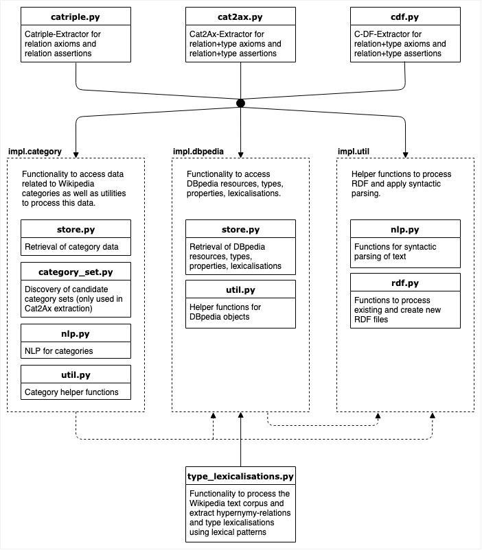

# Cat2Ax

Cat2Ax is an approach for the extraction of axioms and assertions for Wikipedia categories to enrich the ontology of a Wikipedia-based knowledge graph.

In this package you can also find implementations of the two most closely related approaches Catriple and C-DF.

__How to cite?__

```Heist, Nicolas; Paulheim, Heiko. Uncovering the Semantics of Wikipedia Categories. ISWC 2019. Auckland, NZ.```

A preprint of the paper can be found [on arXiv](http://arxiv.org/abs/1906.12089).

## Configuration
### Prerequisites
- Python 3
- pipenv (https://pipenv.readthedocs.io/en/latest/)

Note: If you have problems with your pipenv installation, you can also run the code directly via python. Just make sure to install all the dependencies given in `Pipfile` and `Pipfile.lock`. 

### System Requirements
- You need a machine with at least 100 GB of RAM as we load most of DBpedia in memory to speed up the extraction
  - If that is not possible for you and you nevertheless want to run the extraction, you can change the functionalities in `impl.category.store` and `impl.dbpedia.store` to use a database instead 
- During the first execution of an extraction you need a stable internet connection as the required DBpedia files are downloaded automatically 

### Setup
- In the project source directory, create and initialize a virtual environment with pipenv (run in terminal):
```
pipenv install
```

- Download the spacy corpus (run in terminal):
```
pipenv run python -m spacy download en_core_web_lg
```

- Download the wordnet corpus of nltk (run in python):
```
import nltk
nltk.download('wordnet')
```

### Basic Configuration Options

You can configure the application-specific parameters as well as logging- and file-related parameters in `config.yaml`. 

## Usage

### Extractors
Run the extraction methods with pipenv:
```
pipenv run cat2ax.py
pipenv run catriple.py
pipenv run cdf.py
```
All the required resources, like DBpedia files, will be downloaded automatically during execution.
The extracted axioms and assertions are placed in the `results` folder.

### Lexicalisations
If you want to extract the type lexicalisations (not necessary as we provide them as cache file), run the following:
```
pipenv run type_lexicalisations.py
```
Note that the extraction of type lexicalisations might take several days!

### Graphs
To reproduce the main graphs of the paper, first run the extraction (or download the results and place them in the `results` folder) and then run the following:
```
pipenv run graphs.py
```
The produced graphs are placed in the `results` folder.

## Results

If you don't want to run the extraction yourself, you can find the results [here](http://data.dws.informatik.uni-mannheim.de/Cat2Ax/).

## Documentation

The code is documented on function-level. For an overview of the architecture of the extraction tool, refer to this diagram:



## License
MIT.
https://opensource.org/licenses/MIT
